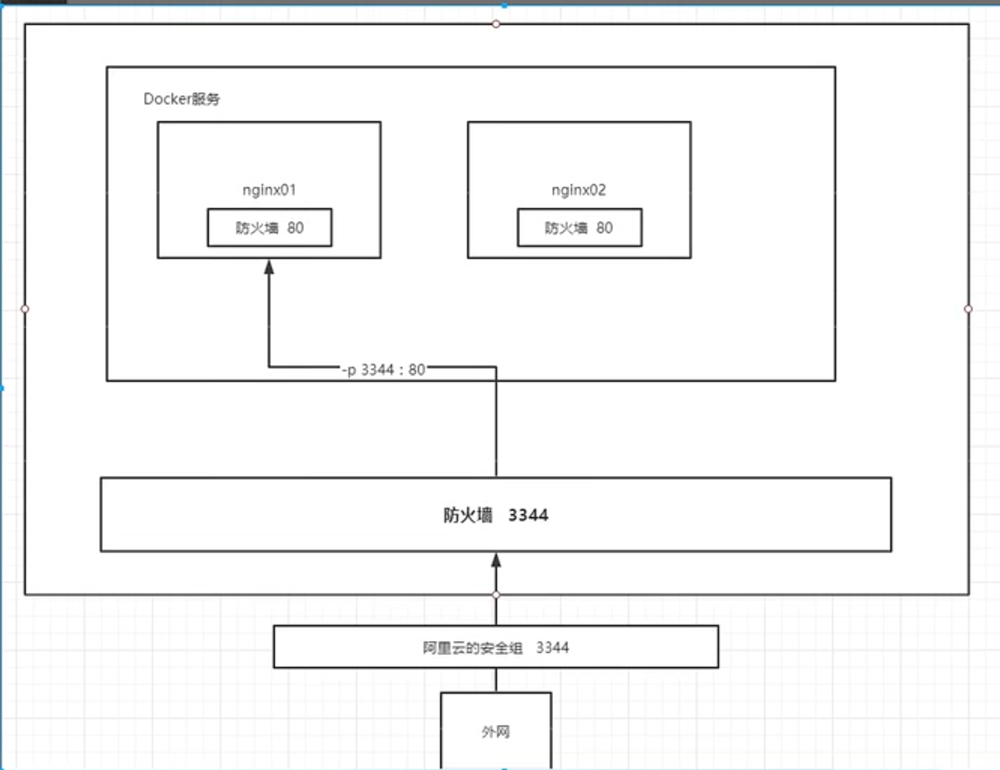

## docker详解
 
ssh -p 22 root@121.40.79.42
Tonghua@214.


##阿里云镜像加载速度
[https://cr.console.aliyun.com/cn-hangzhou/instance/mirrors][镜像加速器]
[https://ecs.console.aliyun.com/home][云服务器ECS]
[https://ecs.console.aliyun.com/home][home]

```
    1. 安装／升级Docker客户端
    推荐安装1.10.0以上版本的Docker客户端，参考文档docker-ce
    
    2. 配置镜像加速器
    针对Docker客户端版本大于 1.10.0 的用户
    
    您可以通过修改daemon配置文件/etc/docker/daemon.json来使用加速器
    
    sudo mkdir -p /etc/docker
    sudo tee /etc/docker/daemon.json <<-'EOF'
    {
      "registry-mirrors": ["https://a69itjlw.mirror.aliyuncs.com"]
    }
    EOF
    sudo systemctl daemon-reload
    sudo systemctl restart docker

```

# docker 安装说明
[https://hub.docker.com/search]
##服务器信息
```
    [root@iZbp14dqa7qpw2zpjdp06mZ /]# cat /etc/os-release
    NAME="CentOS Linux"
    VERSION="7 (Core)"
    ID="centos"
    ID_LIKE="rhel fedora"
    VERSION_ID="7"
    PRETTY_NAME="CentOS Linux 7 (Core)"
    ANSI_COLOR="0;31"
    CPE_NAME="cpe:/o:centos:centos:7"
    HOME_URL="https://www.centos.org/"
    BUG_REPORT_URL="https://bugs.centos.org/"
    
    CENTOS_MANTISBT_PROJECT="CentOS-7"
    CENTOS_MANTISBT_PROJECT_VERSION="7"
    REDHAT_SUPPORT_PRODUCT="centos"
    REDHAT_SUPPORT_PRODUCT_VERSION="7"
```

##docker with CentOS
[https://docs.docker.com/engine/install/centos/][dockerDoc]

### Uninstall old versions
```
  sudo yum remove docker \
                   docker-client \
                   docker-client-latest \
                   docker-common \
                   docker-latest \
                   docker-latest-logrotate \
                   docker-logrotate \
                   docker-engine
```

### Set up the repository
```
 sudo yum install -y yum-utils
 sudo yum-config-manager \
    --add-repo \
    https://download.docker.com/linux/centos/docker-ce.repo # 默认是国外的

 sudo yum-config-manager \
    --add-repo \
    https://mirrors.aliyun.com/docker-ce/linux/centos/docker-ce.repo # 推荐使用阿里云


```


### 更新软件包索引
`yum makecache fast`


###install/uninstall docker docker-ce社区 ee企业版
[https://docs.docker.com/engine/install/centos/][centos版本安装]
```
    sudo yum install docker-ce docker-ce-cli containerd.io docker-buildx-plugin docker-compose-plugin

    安装后启动： systemctl start docker 
    
    测试是否安装成功：

    [root@iZbp14dqa7qpw2zpjdp06mZ /]# docker version
    Client: Docker Engine - Community
     Version:           23.0.1
     API version:       1.42
     Go version:        go1.19.5
     Git commit:        a5ee5b1
     Built:             Thu Feb  9 19:51:00 2023
     OS/Arch:           linux/amd64
     Context:           default
    
    Server: Docker Engine - Community
     Engine:
      Version:          23.0.1
      API version:      1.42 (minimum version 1.12)
      Go version:       go1.19.5
      Git commit:       bc3805a
      Built:            Thu Feb  9 19:48:42 2023
      OS/Arch:          linux/amd64
      Experimental:     false
     containerd:
      Version:          1.6.18
      GitCommit:        2456e983eb9e37e47538f59ea18f2043c9a73640
     runc:
      Version:          1.1.4
      GitCommit:        v1.1.4-0-g5fd4c4d
     docker-init:
      Version:          0.19.0
      GitCommit:        de40ad0


     测试启动镜像：docker run hello-world

    [root@iZbp14dqa7qpw2zpjdp06mZ /]# docker run hello-world
    Unable to find image 'hello-world:latest' locally
    latest: Pulling from library/hello-world
    2db29710123e: Pull complete 
    Digest: sha256:6e8b6f026e0b9c419ea0fd02d3905dd0952ad1feea67543f525c73a0a790fefb
    Status: Downloaded newer image for hello-world:latest
    
    Hello from Docker!
    This message shows that your installation appears to be working correctly.

```

###卸载docker
```
 sudo yum remove docker-ce docker-ce-cli containerd.io docker-buildx-plugin docker-compose-plugin docker-ce-rootless-extras
 rm -rf /var/lib/docker  /var/lib/docker是docker默认的工作路径
```

###docker命令
[https://docs.docker.com/engine/reference/commandine/][帮助文档的地址]

###镜像命令
```
    docker version  # 显示docker的版本
    docker info # 显示docker的系统信息，包括镜像和容器数量
    docker 命令 --help
    docker images #查看docker image
```

```
[root@iZbp14dqa7qpw2zpjdp06mZ /]# docker search mysql
NAME                            DESCRIPTION                                      STARS     OFFICIAL   AUTOMATED
mysql                           MySQL is a widely used, open-source relation…   13890     [OK]       
mariadb                         MariaDB Server is a high performing open sou…   5296      [OK]       
percona                         Percona Server is a fork of the MySQL relati…   600       [OK]       
phpmyadmin                      phpMyAdmin - A web interface for MySQL and M…   750       [OK]       
circleci/mysql                  MySQL is a widely used, open-source relation…   29                   
bitnami/mysql                   Bitnami MySQL Docker Image                       80                   [OK]
bitnami/mysqld-exporter                                                          4                    
ubuntu/mysql                    MySQL open source fast, stable, multi-thread…   43                   
cimg/mysql                                                                       0                    
rapidfort/mysql                 RapidFort optimized, hardened image for MySQL    14                   
google/mysql                    MySQL server for Google Compute Engine           23                   [OK]
ibmcom/mysql-s390x              Docker image for mysql-s390x                     2                    
rapidfort/mysql8-ib             RapidFort optimized, hardened image for MySQ…   0                    
hashicorp/mysql-portworx-demo                                                    0                    
newrelic/mysql-plugin           New Relic Plugin for monitoring MySQL databa…   1                    [OK]
rapidfort/mysql-official        RapidFort optimized, hardened image for MySQ…   0                    
databack/mysql-backup           Back up mysql databases to... anywhere!          82                   
linuxserver/mysql               A Mysql container, brought to you by LinuxSe…   38                   
mirantis/mysql                                                                   0                    
docksal/mysql                   MySQL service images for Docksal - https://d…   0                    
vitess/mysqlctld                vitess/mysqlctld                                 1                    [OK]
linuxserver/mysql-workbench                                                      48                   
eclipse/mysql                   Mysql 5.7, curl, rsync                           0                    [OK]
bitnamicharts/mysql                                                              0                    
drud/mysql                                                                       0                    
[root@iZbp14dqa7qpw2zpjdp06mZ /]# docker search --help

Usage:  docker search [OPTIONS] TERM

Search Docker Hub for images

Options:
  -f, --filter filter   Filter output based on conditions provided
      --format string   Pretty-print search using a Go template
      --limit int       Max number of search results
      --no-trunc        Don't truncate output
[root@iZbp14dqa7qpw2zpjdp06mZ /]# docker search mysql --filter STARS=3000
NAME      DESCRIPTION                                      STARS     OFFICIAL   AUTOMATED
mysql     MySQL is a widely used, open-source relation…   13890     [OK]       
mariadb   MariaDB Server is a high performing open sou…   5296      [OK]       
[root@iZbp14dqa7qpw2zpjdp06mZ /]# 

```

```下载镜像 docker pull 镜像名:[:tag]
[root@iZbp14dqa7qpw2zpjdp06mZ /]# docker pull mysql
Using default tag: latest       #如果不写tag默认就是latest
Using default tag: latest
latest: Pulling from library/mysql
72a69066d2fe: Pull complete 
93619dbc5b36: Pull complete 
99da31dd6142: Pull complete 
626033c43d70: Pull complete 
37d5d7efb64e: Pull complete 
ac563158d721: Pull complete 
d2ba16033dad: Pull complete 
688ba7d5c01a: Pull complete 
00e060b6d11d: Pull complete 
1c04857f594f: Pull complete 
4d7cfa90e6ea: Pull complete 
e0431212d27d: Pull complete 
Digest: sha256:e9027fe4d91c0153429607251656806cc784e914937271037f7738bd5b8e7709
Status: Downloaded newer image for mysql:latest
docker.io/library/mysql:latest

## docker pull mysql 等价于 docker pull docker.io/library/mysql:latest


[root@iZbp14dqa7qpw2zpjdp06mZ ~]# docker pull mysql:5.7
5.7: Pulling from library/mysql
72a69066d2fe: Already exists 
93619dbc5b36: Already exists 
99da31dd6142: Already exists 
626033c43d70: Already exists 
37d5d7efb64e: Already exists 
ac563158d721: Already exists 
d2ba16033dad: Already exists 
0ceb82207cd7: Pull complete 
37f2405cae96: Pull complete 
e2482e017e53: Pull complete 
70deed891d42: Pull complete 
Digest: sha256:f2ad209efe9c67104167fc609cca6973c8422939491c9345270175a300419f94
Status: Downloaded newer image for mysql:5.7
docker.io/library/mysql:5.7
```

###删除镜像
`docker images`
`docker rmi 容器id`
`docker rmi -f 3218b38490ce` 
`docker rmi -f 3218b38490ce 镜像id 镜像id ..` 
`docker rmi -f $(docker images -aq) #删除全部镜像`

###删除全部容器
`docker rm -f $(docker ps -aq)`

###容器命令
> docker run [可选参数] image
```
    --name ="Name" 容器名称 tomcat01 tomcat02, 用来区分容器
    -d  后台方式运行
    -it 使用交换方式运行，进入容器查看内容
    -p  指定容器的端口 -p 8080:8080
        -p ip:主机端口：容器端口
        -p 主机端口：容器端口 （常用）
        -p 容器端口
        容器端口

    -P  随机指定端口
```
> docker run -it centos /bin/bash          #启动并进入容器   不开启新命令行#输入exit退出容器
> docker exec -it 46e3b96d829c /bin/bash   #交互模式进入容器 开启新命令行
> docker attach 46e3b96d829c   #直接进入容器

> docker ps  #查看当前正在运行的容器
> docker ps -a  #可以显示运行过
> docker ps -n=? #显示最近创建的容器  
> docker ps -q #只显示容器的编号 #docker ps -aq

> exit #停止并退出容器
> Ctrl/control + P + Q   # 不停止退出 (大写的pP 大写的)

> `docker rm 容器id  #删除指定容器，不能删除正在运行的容器，如果要强制删除rm -f`
>
> `docker rm -f $(docker ps -ap) #删除所有的容器`
>
> `docker ps -a -q|xargs docker rm| #删除所有容器`
>
> `docker start 容器id`
>
> `docker restart 容器id`
>
> `docker stop 容器id`
>
> `docker kill 容器id`
>


###容器日志
- docker run -d 镜像名 #docker ps 发下centos停止了
- docker容器使用后台运行，就必须要有一个前台进出，docker发现没有应用，就会自动停止
- nginx,容器启动后，发现自己没有提供服务，就会立刻停止。

```
     `docker logs -f -t --tail 10 容器id/容器名  #显示指定容器行数`

     `docker inspect 46e3b96d829c`  #查看容器详细信息

     `docker run -d centos /bin/sh -c "while true;do echo kuangsheng;sleep 1;done`

```

###拷贝容器里的数据

`docker cp 45b57ce2e82c:/home/test.java  /home`
```
   [root@iZbp14dqa7qpw2zpjdp06mZ home]# docker cp 45b57ce2e82c:/home/test.java /home
   Preparing to copy...
   Successfully copied 1.536kB to /home
   [root@iZbp14dqa7qpw2zpjdp06mZ home]# ls
   kuangshen.java  test.java
   [root@iZbp14dqa7qpw2zpjdp06mZ home]# 

```


###安装ngnix
> docker pull ngnix
>
> docker run -d --name nginx01 -p3344:80 nginx
>
> curl localhost:3344   #测试路由

```
    [root@iZbp14dqa7qpw2zpjdp06mZ ~]# docker ps
    CONTAINER ID   IMAGE     COMMAND                   CREATED       STATUS       PORTS                                   NAMES
    d4f1b300c14a   nginx     "/docker-entrypoint.…"   3 hours ago   Up 3 hours   0.0.0.0:3344->80/tcp, :::3344->80/tcp   nginx01
    [root@iZbp14dqa7qpw2zpjdp06mZ ~]# docker exec -it nginx01 /bin/bash
    root@d4f1b300c14a:/# whereis nginx
    nginx: /usr/sbin/nginx /usr/lib/nginx /etc/nginx /usr/share/nginx
    root@d4f1b300c14a:/# 

```

###安装tomcat

> docker run -it --rm tomcat:9.0   #用完即删
>
>cp -r webapps.dist/* webapps    # 将webapps.dist目录下的所有文件放到 webapps里面
>

###安装elasticsearch
```
    docker run -d --name elasticsearch -p 9200:9200 -p 9300:9300 -e "discovery.type=single-node" elasticsearch:7.6.2
    docker run -d --name elasticsearch -p 9200:9200 -p 9300:9300 -e "discovery.type=single-node" -e ES_JAVA_OPTS="-Xms64m -Xmx512m" elasticsearch:7.6.2   
``` 
###可视化portainer
```
    docker run -d -p 8088:9000 \--restart=always -v /var/run/docker.sock:/var/run/docker.sock --privileged=true portainer/portainer

```


###commit 镜像
> docker commit -m="提交的描述信息" -a = "作者" 容器id 目标镜像
`提交的容器会变成新的镜像,该镜像会保留之前的对容器做的改动`
`docker commit -a="kuangshen" -m="add webapps app" 7a0120b57932 tomcat02:1.0`


###容器数据卷使用
> 挂载

```
    docker run -it -v /home/ceshi:/home centos /bin/bash
    docker inspect 4024ab7dc01b   #容器需要启动
     "Mounts": [
                {
                    "Type": "bind",
                    "Source": "/home/ceshi",
                    "Destination": "/home",
                    "Mode": "",
                    "RW": true,
                    "Propagation": "rprivate"
                }
      ],

      镜像启动后，会重新生成容器


```

###安装mysql
- 运行容器，需要做数据挂载！ 安装启动mysql , 需要配置密码 （-e为变量的意思）
- 官方测试，docker run --name some-mysql -e MYSQL_ROOT_PASSWORD=123456 -d mysql:5.7 
- 挂载 docker run -d -p 3310:3306 -v /home/mysql/conf:/etc/mysql/conf.d -v /home/mysql/data:/var/lib/mysql -e MYSQL_ROOT_PASSWORD=123456 --name mysql01 mysql:5.7
- 直接删除容器，我们挂载到本地的数据卷不会丢失

= 匿名挂载
= docker run -d -P --name nginx01 -v /etc/nginx nginx

= 具名挂载
= docker run -d -P --name nginx02 -v juming-nginx:/etc/nginx nginx
= 查看挂载信息
= docker volume inspect juming-nginx

```
    [root@jianguobaobao ~]# docker volume inspect juming-nginx
    [
        {
            "CreatedAt": "2023-03-08T11:20:52+08:00",
            "Driver": "local",
            "Labels": null,
            "Mountpoint": "/var/lib/docker/volumes/juming-nginx/_data",
            "Name": "juming-nginx",
            "Options": null,
            "Scope": "local"
        }
    ]
```

> 所有的docker容器内的卷，没有指定目录的情况下都在 /var/lib/docker/volumes/juming-nginx
> -v 容器路径   #匿名挂载
> -v 卷名:容器内路径 #具名挂载
> -v  /宿主主机路径:容器内路径
> docker run -d -P --name nginx02 -v juming-nginx:/etc/nginx:ro nginx
> docker run -d -P --name nginx02 -v juming-nginx:/etc/nginx:rw nginx
> 拓展：
> 通过 -v 容器内路径：ro: readonly #只读
> 通过 -v 容器内路径：rw: readwrite #可读可写
>
>

#Dockerfile
> dockerfile 用来构建docker镜像的构建文件！命令脚本

   FORM centos
  
   VOLUME ["volume01","volume02"]  #同步挂载的目录,匿名挂载
  
   CMD echo "---end---"
  
   CMD /bin/bash

```
  [root@jianguobaobao docker-test-volume]# docker build -f /home/docker-test-volume/dockerfile1 -t kuangshen/centos:1.0 .
  [+] Building 0.2s (5/5) FINISHED                                                                                                                                                                         
   => [internal] load build definition from dockerfile1                                                                                                                                               0.1s
   => => transferring dockerfile: 120B                                                                                                                                                                0.0s
   => [internal] load .dockerignore                                                                                                                                                                   0.1s
   => => transferring context: 2B                                                                                                                                                                     0.0s
   => [internal] load metadata for docker.io/library/centos:latest                                                                                                                                    0.0s
   => [1/1] FROM docker.io/library/centos                                                                                                                                                             0.0s
   => exporting to image                                                                                                                                                                              0.0s
   => => exporting layers                                                                                                                                                                             0.0s
   => => writing image sha256:3fe61907202c18b4acfa4c53909aabad8c304c21db4db321c59f9f8eb3b7951a                                                                                                        0.0s
   => => naming to docker.io/kuangshen/centos:1.0                                                                                                                                                     0.0s
  [root@jianguobaobao docker-test-volume]# 
```

###多个mysql实现数据共享
docker run -it --name docker02 --volumes-from docker01 kuangshen/centos:1.0

[root@jianguobaobao /]# docker ps
CONTAINER ID   IMAGE                  COMMAND                   CREATED         STATUS         PORTS                                                  NAMES
db13bd80f2e7   kuangshen/centos:1.0   "/bin/sh -c /bin/bash"    2 minutes ago   Up 2 minutes                                                          docker02
5215065168ca   kuangshen/centos:1.0   "/bin/sh -c /bin/bash"    7 minutes ago   Up 7 minutes                                                          docker01
75adff2af107   nginx                  "/docker-entrypoint.…"   3 hours ago     Up 3 hours     0.0.0.0:32769->80/tcp, :::32769->80/tcp                nginx02
983f4e1b6601   nginx                  "/docker-entrypoint.…"   3 hours ago     Up 3 hours     0.0.0.0:32768->80/tcp, :::32768->80/tcp                nginx01
0419b80a7c91   mysql:5.7              "docker-entrypoint.s…"   3 hours ago     Up 3 hours     33060/tcp, 0.0.0.0:3310->3306/tcp, :::3310->3306/tcp   mysql01

> 具名挂载
> docker run -d -p 3310:3306 -v /home/mysql/conf:/etc/mysql/conf.d -v /home/mysql/data:/var/lib/mysql -e MYSQL_ROOT_PASSWORD=123456 --name mysql01 mysql:5.7
> 匿名挂载
> docker run -d -p 3310:3306 -v /etc/mysql/conf.d  -v /var/lib/mysql -e MYSQL_ROOT_PASSWORD=123456 --name mysql01 mysql:5.7
> 数据共享
> docker run -d -p 3310:3306 -e MYSQL_ROOT_PASSWORD=123456 --name mysql02 --volumes-from mysql01 mysql:5.7
>
>

##编写dokerFile
> centos
```
   FROM scratch
   ADD centos-7-x86_64-docker.tar.xz /
   
   LABEL \
       org.label-schema.schema-version="1.0" \
       org.label-schema.name="CentOS Base Image" \
       org.label-schema.vendor="CentOS" \
       org.label-schema.license="GPLv2" \
       org.label-schema.build-date="20201113" \
       org.opencontainers.image.title="CentOS Base Image" \
       org.opencontainers.image.vendor="CentOS" \
       org.opencontainers.image.licenses="GPL-2.0-only" \
       org.opencontainers.image.created="2020-11-13 00:00:00+00:00"
   
   CMD ["/bin/bash"]

```

> 1.每个保留关键字（指令）都是必须是大写字母
> 2.执行顺序从上到下执行
> 3.#表示注解

 

> FROM   # 基础镜像，一切从这开始构建
> MAINTAINER    # 镜像是谁写的，姓名 + 邮箱
> RUN   # 镜像构建的时候需要运行的命令
> ADD   # 步骤，tocat镜像，这个tomcat压缩包
> WORKDIR   # 镜像的工作目录 
> VOLUME    # 挂载的目录
> EXPOST     # 暴露端口配置
> CMD   # 指定这个容器启动的时候要运行的命令，之后最后一个会生效，可被替代
> ENTRYPOINT     # 指定这个容器启动的时候要运行的命令，可以追加命令
> ONBUILD   #当构建一个被基础dockerFile这个时候就会运行ONBUILD的指令，触发指令
> COPY  #类似ADD, 讲我们文件拷贝到镜像中
> ENV # 构建的时候设置环境变量
> docker build -f dockerfile2 -t mycentos:0.1 .
```
   FROM centos:7
   MAINTAINER kuangshen<24736743@qq.com>
   ENV MYPATH /usr/local      # 默认目录
   WORKDIR $MYPATH
   
   RUN yum -y install vim
   RUN yum -y install net-tools
   
   EXPOSE 80
   
   CMD echo $MYPATH
   CMD echo "----end----"
   CMD /bin/bash


    FROM centos:7
    CMD ["ls","-a"]
```


```
    FROM centos:7
    MAINTAINET kuangshen<234239090@qq.com>
    COPY readme.txt /usr/local/readme.txt
    ADD jre-8u361-linux-x64.tar.gz /usr/local/
    ADD apache-tomcat-9.0.73.tar.gz /usr/local/
    RUN yum -y install vim
    ENV MYPATH /usr/local
    WORKDIR $MYPATH
    
    ENV JAVA_HOME /usr/local/jre1.8.0_361 /home/kuangshen/build/
    ENV CLASSPATH $JAVA_HOME/lib/dt.jar:$JAVA_HOME/lib/tools.jar
    ENV CATALINA_HOME /usr/local/apache-tomcat-9.0.73
    ENV CATALINA_BASH /usr/local/apache-tomcat-9.0.73
    ENV PATH $PATH:$JAVA_HOME/bin:$CATALINA_HOME/lib:$CATALINA_HOME/bin
    EXPOSE 8080
    
    CMD /usr/local/apache-tomcat-9.0.73/bin/startup.sh && tail -F /url/local/apache-tomcat-9.0.73/bin/logs/catalina.out # tail -F 会根据文件名进行追踪并保持重试，当文件文件被移动或删除后，若再次创建同名文件，则会继续追踪该同名文件。

```

> docker run -d -p 9090:8080 --name kuangshentomcat -vtomcat/test:/usr/local/apache-tomcat-9.0.73/webapps/test -v /home/kuangshen/build/tomcat/tomcatlogs/:/usr/local/apache-tomcat-9.0.73/logs diytomcat:0.1

> docker build -f dockerfile4 -t diytomcat:0.1 .

> docker run -d -p 9090:8080 --name kuangshentomcat
> -v /home/kuangshen/build/tomcat/test:/usr/local/apache-tomcat-9.0.73/webapps/test
> -v /home/kuangshen/build/tomcat/tomcatlogs/:/usr/local/apache-tomcat-9.0.73/logs
> diytomcat:0.1 
>
>

##发布项目（由于做卷挂载，我们直接在本地编写项目就可以发布了！）

```
    
    <?xml version="1.0" encoding="UTF-8"?>
    <web-app xmlns="http://xmlns.jcp.org/xml/ns/javaee"
             xmlns:xsi="http://www.w3.org/2001/XMLSchema-instance"
             xsi:schemaLocation="http://xmlns.jcp.org/xml/ns/javaee
              http://xmlns.jcp.org/xml/ns/javaee/web-app_4_0.xsd"
             version="4.0">
    
    </web-app>

```

```
    <%@ page contentType="text/html;charset=UTF-8" language="java" %>
    <!DOCTYPE html>
    <html>
    <head>
        <title>Title</title>
    </head>
    <body>
       Hello World</br>
    <%
        System.out.println("--my test jsp--");
    %>
    </body>
    </html>
```


### docker 网络
[root@jianguobaobao /]# ip addr
1: lo: <LOOPBACK,UP,LOWER_UP> mtu 65536 qdisc noqueue state UNKNOWN group default qlen 1000
    link/loopback 00:00:00:00:00:00 brd 00:00:00:00:00:00
    inet 127.0.0.1/8 scope host lo
       valid_lft forever preferred_lft forever
    inet6 ::1/128 scope host 
       valid_lft forever preferred_lft forever
2: eth0: <BROADCAST,MULTICAST,UP,LOWER_UP> mtu 1500 qdisc pfifo_fast state UP group default qlen 1000
    link/ether 00:16:3e:13:b1:29 brd ff:ff:ff:ff:ff:ff
    inet 172.18.151.116/20 brd 172.18.159.255 scope global dynamic eth0
       valid_lft 315269880sec preferred_lft 315269880sec
    inet6 fe80::216:3eff:fe13:b129/64 scope link 
       valid_lft forever preferred_lft forever
3: docker0: <NO-CARRIER,BROADCAST,MULTICAST,UP> mtu 1500 qdisc noqueue state DOWN group default 
    link/ether 02:42:06:c3:64:b7 brd ff:ff:ff:ff:ff:ff
    inet 172.17.0.1/16 brd 172.17.255.255 scope global docker0
       valid_lft forever preferred_lft forever
    inet6 fe80::42:6ff:fec3:64b7/64 scope link 
       valid_lft forever preferred_lft forever
       
       
### 网络模式
`docker run -d -P --name tomcat01 --net bridge tomcat   # 默认bridge 使用docker0`
`[root@jianguobaobao ~]# docker network ls
 NETWORK ID     NAME      DRIVER    SCOPE
 e6ae74a81913   bridge    bridge    local
 1b69a3652a64   host      host      local
 02ea863a9625   mynet     bridge    local
 23179726b7b7   none      null      local
 [root@jianguobaobao ~]# `
> 自定义网络
> --driver bridge
> --subnet 192.168.0.0/16
> --gateway 192.168.0.1
`docker network create --driver bridge --subnet 192.168.0.0/16 --gateway 192.168.0.1 mynet`
```
   [root@jianguobaobao ~]# docker network inspect mynet
   [
       {
           "Name": "mynet",
           "Id": "02ea863a9625c51380b322d3c8c55277ba12eb7d069e61f4a9de2090c10cda74",
           "Created": "2023-03-09T16:23:34.329285086+08:00",
           "Scope": "local",
           "Driver": "bridge",
           "EnableIPv6": false,
           "IPAM": {
               "Driver": "default",
               "Options": {},
               "Config": [
                   {
                       "Subnet": "192.168.0.0/16",
                       "Gateway": "192.168.0.1"
                   }
               ]
           },
           "Internal": false,
           "Attachable": false,
           "Ingress": false,
           "ConfigFrom": {
               "Network": ""
           },
           "ConfigOnly": false,
           "Containers": {},
           "Options": {},
           "Labels": {}
       }
   ]


[root@jianguobaobao ~]# docker exec -it tomcat-net-01 ping 192.168.0.2
PING 192.168.0.2 (192.168.0.2) 56(84) bytes of data.
64 bytes from 192.168.0.2: icmp_seq=1 ttl=64 time=0.070 ms
64 bytes from 192.168.0.2: icmp_seq=2 ttl=64 time=0.063 ms
64 bytes from 192.168.0.2: icmp_seq=3 ttl=64 time=0.046 ms
64 bytes from 192.168.0.2: icmp_seq=4 ttl=64 time=0.047 ms

```

```
    docker network connect mynet tomcat01
    docker exec -it tomcat01 ping tomcat-net-01

```


###部署redis集群

> 创建网络

```[root@jianguobaobao ~]# docker network create redis --subnet 172.38.0.0/16
 7aab3a0aef66d861cec2a77fad51a9c56628fa370f210856ce2ffaff5ea357d5
 [root@jianguobaobao ~]# docker network ls
 NETWORK ID     NAME      DRIVER    SCOPE
 e6ae74a81913   bridge    bridge    local
 1b69a3652a64   host      host      local
 02ea863a9625   mynet     bridge    local
 23179726b7b7   none      null      local
 7aab3a0aef66   redis     bridge    local
 [root@jianguobaobao ~]#

[root@jianguobaobao ~]# for port in $(seq 1 6); \
> do \
> mkdir -p /mydata/redis/node-${port}/conf
> touch /mydata/redis/node-${port}/conf/redis.conf
> cat << EOF >/mydata/redis/node-${port}/conf/redis.conf
> port 6379 
> bind 0.0.0.0
> cluster-enabled yes 
> cluster-config-file nodes.conf
> cluster-node-timeout 5000
> cluster-announce-ip 172.38.0.1${port}
> cluster-announce-port 6379
> cluster-announce-bus-port 16379
> appendonly yes
> EOF
> done

 ```
> 启动redis
```
    docker run -p 6371:6379 -p 16371:16379 --name redis-1 \
        -v /mydata/redis/node-1/data:/data \
        -v /mydata/redis/node-1/conf/redis.conf:/etc/redis/redis.conf \
        -d --net redis --ip 172.38.0.11 redis:5.0.9-alpine3.11 redis-server /etc/redis/redis.conf

    docker run -p 6372:6379 -p 16372:16379 --name redis-2 \
        -v /mydata/redis/node-2/data:/data \
        -v /mydata/redis/node-2/conf/redis.conf:/etc/redis/redis.conf \
        -d --net redis --ip 172.38.0.12 redis:5.0.9-alpine3.11 redis-server /etc/redis/redis.conf

    docker run -p 6373:6379 -p 16373:16379 --name redis-3 \
        -v /mydata/redis/node-3/data:/data \
        -v /mydata/redis/node-3/conf/redis.conf:/etc/redis/redis.conf \
        -d --net redis --ip 172.38.0.13 redis:5.0.9-alpine3.11 redis-server /etc/redis/redis.conf

        ...

    docker run -p 6376:6379 -p 16376:16379 --name redis-6 \
        -v /mydata/redis/node-6/data:/data \
        -v /mydata/redis/node-6/conf/redis.conf:/etc/redis/redis.conf \
        -d --net redis --ip 172.38.0.16 redis:5.0.9-alpine3.11 redis-server /etc/redis/redis.conf

    ***docker exec -it redis-1 /bin/sh

    /data # redis-cli --cluster create 172.38.0.11:6379 172.38.0.12:6379 172.38.0.13:6379 172.38.0.14:6379 172.38.0.15:6379 172.38.0.16:6379 --cluster-replicas 1
    >>> Performing hash slots allocation on 6 nodes...
    Master[0] -> Slots 0 - 2730
    Master[1] -> Slots 2731 - 5460
    Master[2] -> Slots 5461 - 8191
    Master[3] -> Slots 8192 - 10922
    Master[4] -> Slots 10923 - 13652
    Master[5] -> Slots 13653 - 16383
    M: 4c4e5a22d9d2a00628d84e9f6384fc087231f32a 172.38.0.11:6379
       slots:[0-2730] (2731 slots) master
    M: fdf8342cf439619ea919daec2cfcca12ff06b690 172.38.0.12:6379
       slots:[2731-5460] (2730 slots) master
    M: 89761c9a401ea1ab821948e5e9fe0a13143790d3 172.38.0.13:6379
       slots:[5461-8191] (2731 slots) master
    M: 11f7a4e18d686aca26f0b8fde02fc0f631437743 172.38.0.14:6379
       slots:[8192-10922] (2731 slots) master
    M: acd09cd664f030a845294a7c557e562293a8ece9 172.38.0.15:6379
       slots:[10923-13652] (2730 slots) master
    M: 5790b092c856c5cd426a3f5579ea3922c8ce2585 172.38.0.16:6379
       slots:[13653-16383] (2731 slots) master
    Can I set the above configuration? (type 'yes' to accept): 


    [root@jianguobaobao /]# docker exec -it redis-1 /bin/sh
    /data # redis-cli -c
    127.0.0.1:6379> cluster info
    127.0.0.1:6379> cluster nodes
    127.0.0.1:6379> set a b
    -> Redirected to slot [15495] located at 172.38.0.16:6379
    OK
    172.38.0.16:6379> get a
    "b"


```


###打包spirngboot

```
    [root@jianguobaobao idea]# docker build -t kuangshen666 .
    [+] Building 15.2s (7/7) FINISHED                                                                                                                                                                                                                             
     => [internal] load build definition from Dockerfile                                                                                                                                                                                                     0.0s
     => => transferring dockerfile: 152B                                                                                                                                                                                                                     0.0s
     => [internal] load .dockerignore                                                                                                                                                                                                                        0.0s
     => => transferring context: 2B                                                                                                                                                                                                                          0.0s
     => [internal] load metadata for docker.io/library/java:8                                                                                                                                                                                               15.2s
     => [internal] load build context                                                                                                                                                                                                                        0.0s
     => => transferring context: 31B                                                                                                                                                                                                                         0.0s
     => [1/2] FROM docker.io/library/java:8@sha256:c1ff613e8ba25833d2e1940da0940c3824f03f802c449f3d1815a66b7f8c0e9d                                                                                                                                          0.0s
     => CACHED [2/2] COPY *.jar /app.jar                                                                                                                                                                                                                     0.0s
     => exporting to image                                                                                                                                                                                                                                   0.0s
     => => exporting layers                                                                                                                                                                                                                                  0.0s
     => => writing image sha256:6328485ce56dc41871ec91588927f5b7055e356ef673311c329d6d7c2bf3eedd                                                                                                                                                             0.0s
     => => naming to docker.io/library/kuangshen666                                                                                                                                                                                                          0.0s
    [root@jianguobaobao idea]# docker ps
    CONTAINER ID   IMAGE     COMMAND   CREATED   STATUS    PORTS     NAMES
    [root@jianguobaobao idea]# docker images
    REPOSITORY     TAG       IMAGE ID       CREATED          SIZE
    kuangshen666   latest    6328485ce56d   17 minutes ago   689MB
    [root@jianguobaobao idea]# docker run -d -P --name kuangshen-springboot-web kuangsheng666

```


